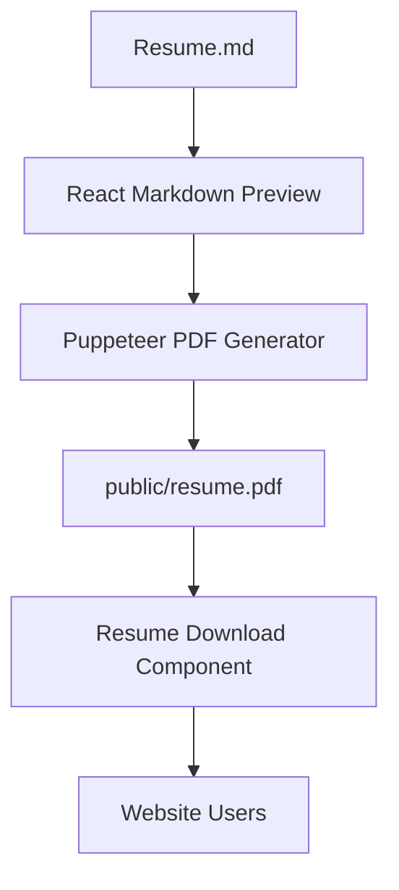
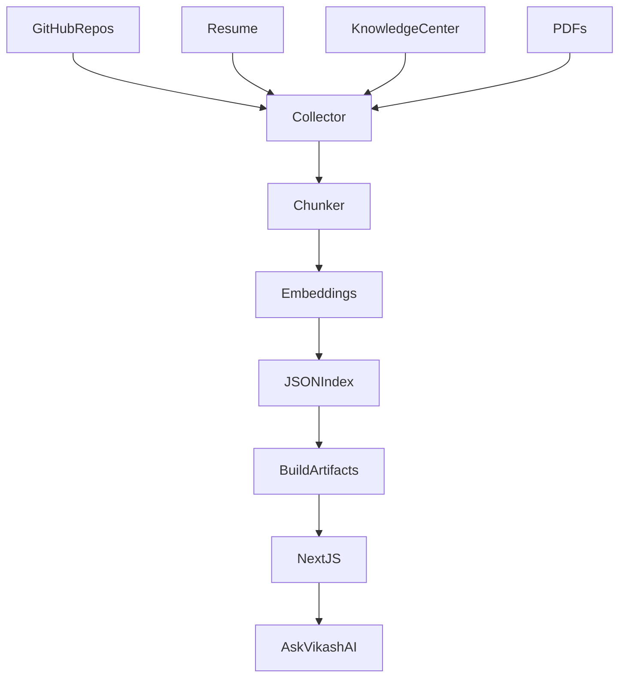

# README.md

# Vikash Portfolio v2 — AI, DevOps & Platform Engineering Portfolio

> Enterprise-grade personal portfolio showcasing 15+ years of experience across Cloud, DevOps, Platform Engineering, GenAI, Observability, and Infrastructure Automation.

---

# Table of Contents

* Overview
* Live Demo
* Features
* Technology Stack
* Architecture
* Local Development Setup
* Installation Guide
* Running the Application
* Resume System Architecture
* Markdown → Preview → PDF Pipeline
* GitHub Actions Automation
* Release Management
* Vercel Deployment
* Engineering Case Studies
* Ask Vikash AI Architecture
* Build-Time RAG Architecture (Planned)
* Knowledge Center Repository
* Repository Structure
* Development Workflow
* Troubleshooting Guide
* Roadmap
* Architectural Decisions
* Pros & Cons
* License

---

# Project Overview

This portfolio is designed as an enterprise-grade engineering showcase rather than a traditional resume website.

The platform demonstrates:

* Cloud Engineering
* Platform Engineering
* DevOps Leadership
* GenAI Development
* Infrastructure as Code
* Observability
* Site Reliability Engineering
* Resume Automation
* Build-Time RAG Architecture
* Knowledge Engineering

---

# Features

## V1 Features

### Hero Section

* Animated professional title rotation
* Modern enterprise UI
* Responsive design
* Social links
* Resume download support

---

### Skills Dashboard

Technology visualization for:

* AWS
* Terraform
* Kubernetes
* Jenkins
* GitHub Actions
* ArgoCD
* Python
* Bedrock
* GenAI
* DevSecOps
* OpenTelemetry
* Grafana
* Prometheus

---

### Terminal Experience

Interactive terminal showcasing:

* forge status
* AI FORGE
* Multi-router architecture
* DevOps workflows

---

### Engineering Timeline

Professional experience visualization.

---

### Projects Section

Showcases:

* AI FORGE
* Enterprise Platform Engineering
* GenAI Systems
* Cloud Automation

---

# V2 Features

---

## Resume Automation System

Source of truth:

```text
resume/resume.md
```

Automatically supports:

```text
Markdown
↓

Web Preview

↓

PDF Generation

↓

Download Button

↓

GitHub Actions

↓

Release Artifacts
```

---

## Resume Download Component

Location:

```text
components/ResumeDownload.tsx
```

Downloads:

```text
public/resume.pdf
```

---

## Test Resume Preview

Route:

```text
/test-resume
```

Purpose:

Preview markdown rendering before PDF generation.

---

## Engineering Case Studies

Route:

```text
/engineering
```

Contains:

* CI/CD Architecture
* Jenkins vs GitHub Actions
* Terraform State Management
* DevSecOps
* Observability
* Interview Scenarios

---

# Technology Stack

---

## Frontend

```text
Next.js 15
React 19
TypeScript
TailwindCSS
Framer Motion
React Icons
Lucide Icons
React Markdown
```

---

## Resume System

```text
Markdown
Puppeteer
GitHub Actions
PDF Generation
```

---

## Future AI Stack

```text
Build-Time RAG
Markdown Knowledge Bases
MiniSearch
LlamaIndex
Embeddings
Static JSON Retrieval
```

---

# Architecture



---

# Future Architecture



---

# Repository Structure

```text
Vikash-Portfolio

├── app
│   ├── engineering
│   │   └── page.tsx
│   │
│   ├── test-resume
│   │   └── page.tsx
│   │
│   └── page.tsx
│
├── components
│   ├── Hero.tsx
│   ├── Navbar.tsx
│   ├── Skills.tsx
│   ├── Projects.tsx
│   ├── ResumeDownload.tsx
│   └── EngineeringChat.tsx
│
├── resume
│   └── resume.md
│
├── build-scripts
│   └── generate-pdf.js
│
├── public
│   └── resume.pdf
│
├── .github
│   └── workflows
│       └── resume-pdf.yml
│
└── README.md
```

---

# Local Setup Guide

---

## Clone Repository

```bash
git clone https://github.com/vikas0486/Vikash-Portfolio.git

cd Vikash-Portfolio
```

---

## Install Dependencies

```bash
npm install
```

---

## Install React Markdown

```bash
npm install react-markdown
```

---

## Install Puppeteer

```bash
npm install puppeteer
```

---

# Running Development Server

```bash
npm run dev
```

---

Access:

```text
http://localhost:3000
```

---

# Production Build Test

Always test before deployment:

```bash
npm run build
```

---

# Resume System

---

## Source of Truth

```text
resume/resume.md
```

Never edit PDFs manually.

Only update:

```text
resume.md
```

---

# Resume Preview

Run:

```bash
npm run dev
```

Open:

```text
http://localhost:3000/test-resume
```

---

# PDF Generation

Generate:

```bash
node build-scripts/generate-pdf.js
```

---

Generated file:

```text
public/resume.pdf
```

---

# Resume Download Component

File:

```text
components/ResumeDownload.tsx
```

Example:

```tsx
export default function ResumeDownload() {

return (

<a
href="/resume.pdf"
download
target="_blank"
>

Download Resume

</a>

)

}
```

---

# GitHub Actions

Workflow:

```text
.github/workflows/resume-pdf.yml
```

Purpose:

Automatically:

```text
Push

↓

Generate PDF

↓

Commit Artifact

↓

Create Release Asset
```

---

# Git Tags

List:

```bash
git tag
```

---

Delete:

```bash
git tag -d v1
```

---

Remote Delete:

```bash
git push origin :refs/tags/v1
```

---

Create:

```bash
git tag -a v2 -m "Portfolio V2"

git push origin v2
```

---

# GitHub Release Process

---

Push Code:

```bash
git add .

git commit -m "feat: Resume automation system"

git push origin main
```

---

Create Release:

```bash
git tag -a v2 -m "Portfolio Version 2"

git push origin v2
```

---

Open:

```text
GitHub

↓

Releases

↓

Create Release
```

---

# Vercel Deployment

---

## Install CLI

```bash
npm install -g vercel
```

---

## Login

```bash
vercel login
```

---

## Deploy

```bash
vercel
```

---

## Production

```bash
vercel --prod
```

---

# Pre-Deployment Checklist

Always verify:

```bash
npm run build
```

Must show:

```text
Compiled Successfully

Lint Passed

Types Passed
```

---

# Engineering Case Studies

Route:

```text
/engineering
```

---

Contains:

---

## CI/CD

Topics:

* Jenkins
* GitHub Actions
* Rollbacks
* Deployment Strategies

---

## Terraform

Topics:

* State Files
* Remote State
* Locking
* Modules
* Multi-Environment Design

---

## DevSecOps

Topics:

* SonarQube
* SAST
* DAST
* IAM
* Secrets Management

---

## Observability

Topics:

* OpenTelemetry
* Prometheus
* Grafana
* Dynatrace

---

## Interview Questions

Topics:

* System Design
* Platform Engineering
* DevOps Architecture
* Leadership Questions

---

# Ask Vikash AI

Planned Feature:

```text
User Question

↓

Mini RAG Engine

↓

Knowledge Base

↓

Static Retrieval

↓

Response Generation
```

---

Examples:

```text
How do you manage Terraform State?

Why GitHub Actions over Jenkins?

How do you implement DevSecOps?

What is your CI/CD strategy?
```

---

# Build-Time RAG

Architecture:

---

Sources:

```text
Resume

GitHub Repositories

AI FORGE

Knowledge Center

Markdown Notes

PDF Documents
```

---

Pipeline:

```text
Collector

↓

Chunker

↓

Embeddings

↓

JSON Index

↓

Static Deployment
```

---

No:

```text
No Pinecone

No Weaviate

No AWS Costs

No Runtime Expenses
```

---

# Knowledge Center Repository

Future:

```text
Vikash-Knowledge-Center
```

---

Purpose:

Store:

```text
Markdown

PDFs

Interview Notes

Architecture Notes

Terraform Examples

Cloud Designs
```

---

Example:

```text
knowledge

├── terraform
├── cicd
├── kubernetes
├── genai
├── aws
├── sre
└── interviews
```

---

# Development Workflow

---

Create Branch:

```bash
git checkout -b feature/new-feature
```

---

Commit:

```bash
git add .

git commit -m "feat: add feature"
```

---

Push:

```bash
git push origin feature/new-feature
```

---

Merge:

```bash
git checkout main

git merge feature/new-feature
```

---

Release:

```bash
git tag -a v3 -m "Release V3"

git push origin v3
```

---

# Troubleshooting Guide

---

## Build Errors

Run:

```bash
npm run build
```

---

## Missing Modules

```bash
npm install
```

---

## Resume Download Not Working

Verify:

```text
public/resume.pdf
```

Exists.

---

## PDF Generator Timeout

Use:

```js
waitUntil:"domcontentloaded"
```

Instead of:

```js
networkidle0
```

---

## Port Already Used

Example:

```text
3000 busy

↓

3002 allocated
```

Access:

```text
localhost:3002
```

---

# Roadmap

---

## V1

Completed:

```text
Portfolio
Projects
Skills
Hero
Timeline
Resume Download
```

---

## V2

Completed:

```text
Resume Automation
Markdown Preview
PDF Generation
GitHub Actions
Engineering Pages
```

---

## V3

Planned:

```text
Profile Kit Generator

Engineering Breakdowns

Dynamic Parsing

Knowledge Center
```

---

## V4

Planned:

```text
Build-Time RAG

AI Search

MiniSearch

Embeddings

Static Retrieval
```

---

## V5

Planned:

```text
Ask Vikash AI

Interview Assistant

Architecture Discussions

Enterprise Knowledge Base
```

---

# Architectural Decisions

---

## Why Markdown?

Pros:

```text
Human Readable

Git Friendly

Easy Automation

Version Control
```

---

## Why Build-Time RAG?

Pros:

```text
No Runtime Cost

No Database

GitHub Friendly

Static Hosting Compatible
```

---

## Why GitHub Actions?

Pros:

```text
Free

Integrated

Version Controlled

Easy Releases
```

---

## Why NextJS?

Pros:

```text
SEO

Performance

App Router

Type Safety
```

---

# License

MIT License

---

Built by:

Vikash Jaiswal

Lead Platform Engineer

Cloud | DevOps | GenAI | Platform Engineering

2026
