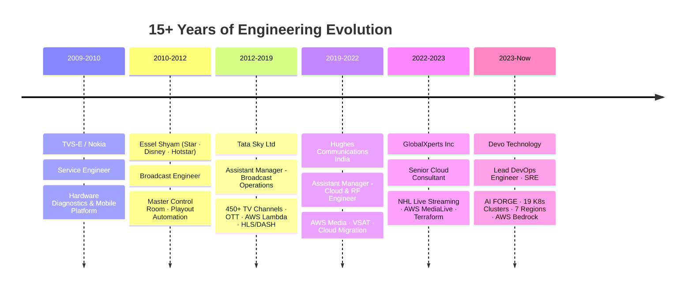
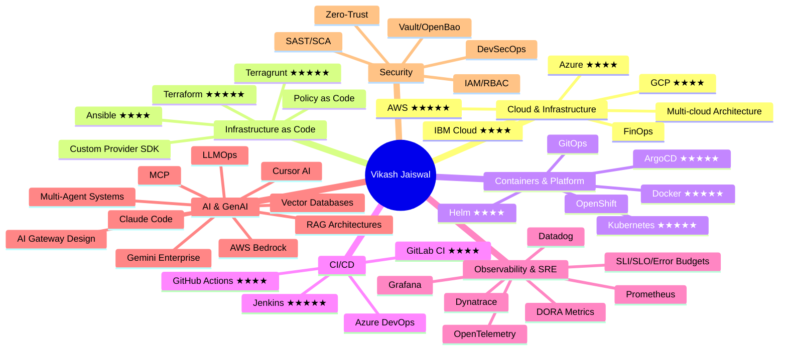
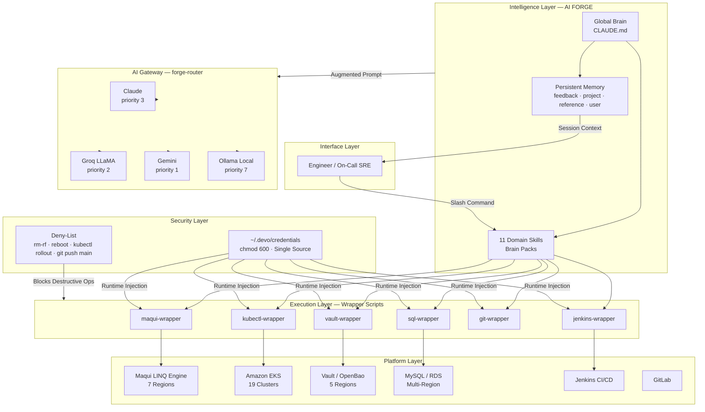
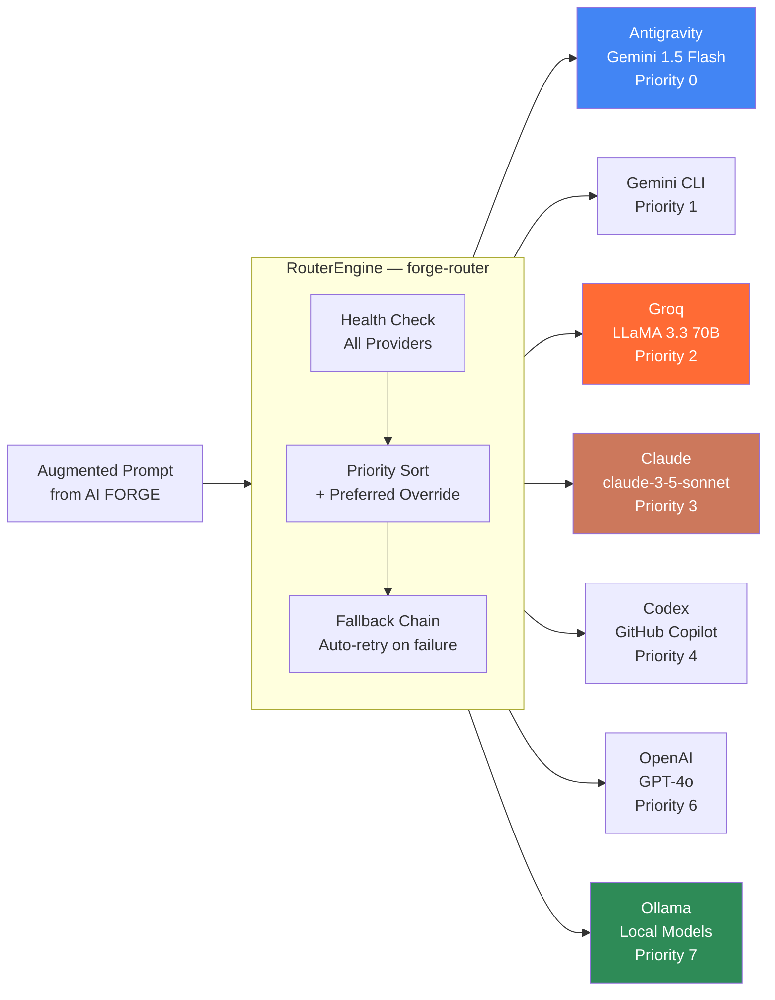
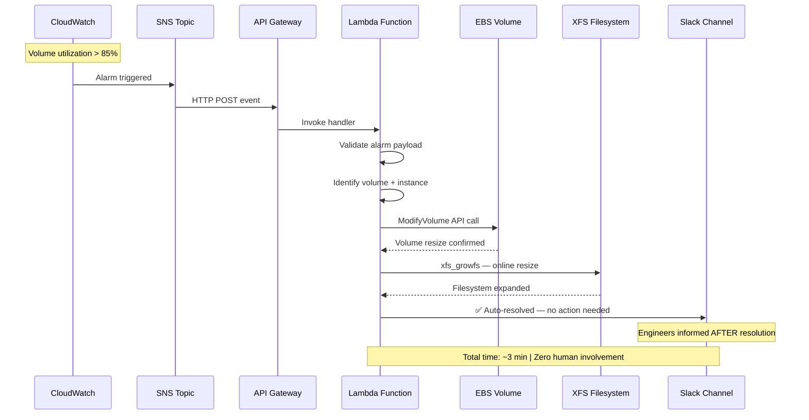
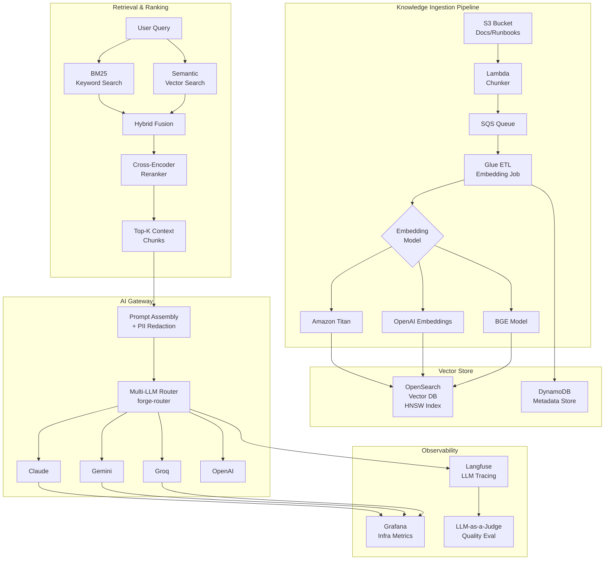
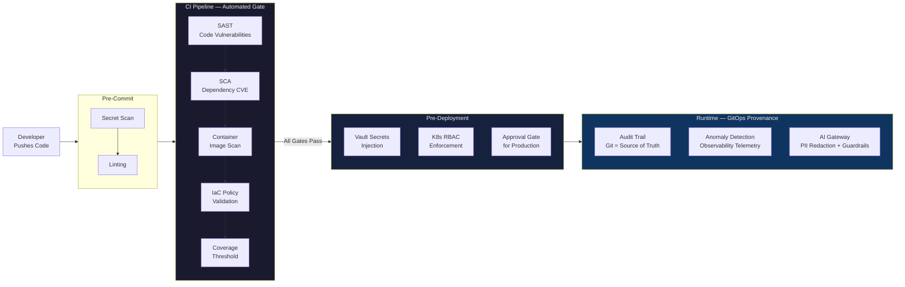
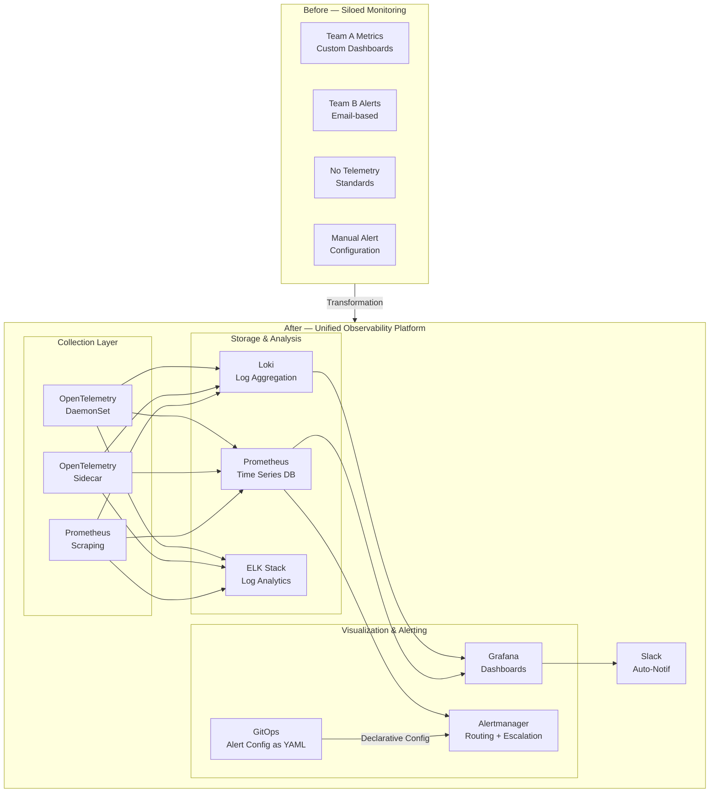
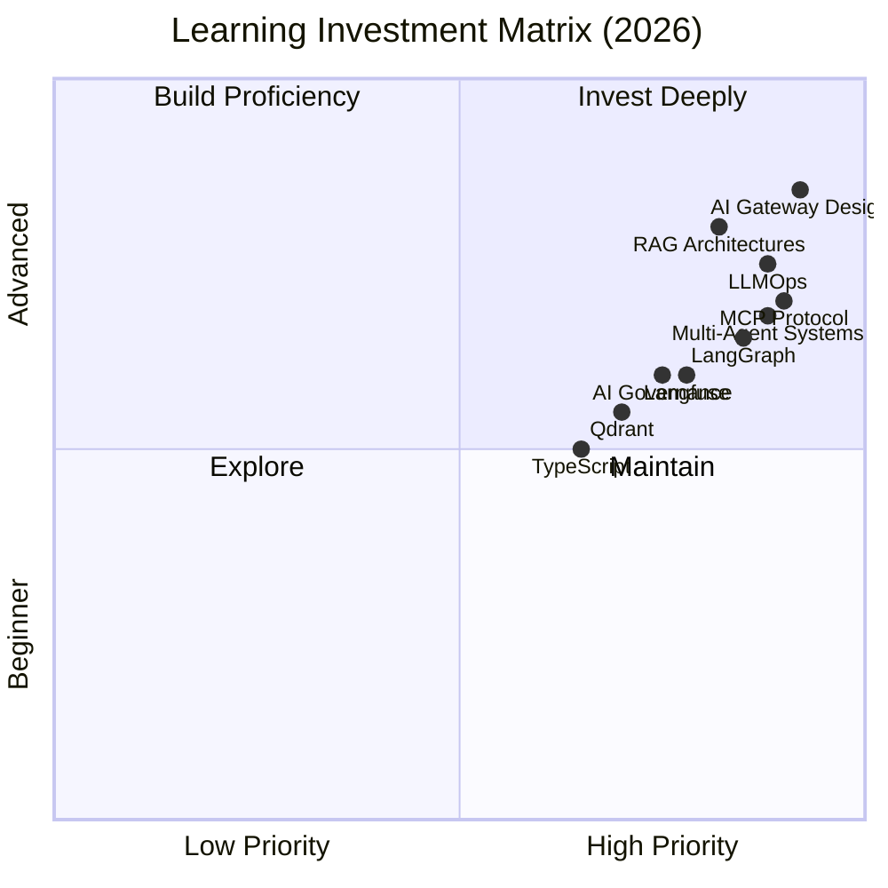

# VIKASH JAISWAL

**Lead Platform Engineer · Principal DevOps Engineer · AI Systems Architect · SRE**

📍 Noida / Gurgaon / Delhi NCR, India &nbsp;|&nbsp; 📞 +91-8588800287 &nbsp;|&nbsp; ✉️ vikashjaiswal.486@gmail.com

> **Available · 15-Day Notice · Open to Remote / PAN India / Global Roles**

---

## Professional Summary

Lead Platform Engineer and Principal DevOps Architect with **15+ years** of progressive experience spanning **Broadcast Operations → OTT/Media Engineering → Multi-Cloud Infrastructure → Site Reliability Engineering → Platform Engineering → Enterprise GenAI Systems**. Proven track record designing, operating, and modernizing large-scale production environments — from 450+ live television channels at Tata Sky to 19 Kubernetes clusters across 7 global regions at Devo Technology.

Builder of **AI FORGE**, an enterprise AI Agent Operating System on AWS Bedrock that reduced engineer troubleshooting ramp-up by ~60%. Author of **forge-router**, a production-ready multi-LLM gateway routing across 8 AI providers. Certified AWS Solutions Architect with deep expertise in Terraform (including **Custom Provider development via Plugin SDK**), GitOps, DevSecOps, observability engineering, and AI platform design. Currently pursuing LLMOps, Agentic AI, RAG architectures, and AI Gateway design as the next platform frontier.

---

## Impact at a Glance

| Metric | Achievement |
|---|---|
| **Experience** | 15+ years across Broadcast, OTT, Cloud, SRE, Platform Engineering, GenAI |
| **Scale** | 19+ Kubernetes clusters · 7 global regions · 450+ live TV channels |
| **AI Innovation** | Built AI FORGE (enterprise GenAI OS) + forge-router (multi-LLM gateway, 8 providers) |
| **Automation** | EBS storage incidents: 45-min manual → 3-min zero-touch Lambda automation |
| **Efficiency** | ~60% reduction in engineer troubleshooting ramp-up via AI-assisted operations |
| **IaC Depth** | Custom Terraform Provider development using Plugin SDK (rare, senior-level skill) |
| **Security** | Zero-secret architecture: Vault/OpenBao across all K8s, Jenkins, GitLab pipelines |
| **Observability** | GitOps-managed Prometheus + OpenTelemetry + Grafana across multi-cloud environments |
| **Multi-cloud** | AWS ★★★★★ · GCP ★★★★ · Azure ★★★★ · IBM Cloud ★★★★ |

---

## Career Progression

---

## Core Competencies

---

## Technical Skills Matrix

### Cloud Platforms & AWS Services

| Category | Technologies |
|---|---|
| **Cloud Platforms** | AWS · Google Cloud (GCP) · Microsoft Azure · IBM Cloud |
| **Compute & Networking** | EC2 · EKS · Lambda · VPC · Route53 · CloudFront · API Gateway · ELB |
| **Storage & Data** | S3 · RDS · DynamoDB · EBS · ElastiCache · Elasticsearch |
| **Automation & Events** | Lambda · Step Functions · SNS · SQS · EventBridge · CloudWatch |
| **Security & Identity** | IAM · SSO · Secrets Manager · KMS · SSM · Organizations |
| **AI & ML** | AWS Bedrock · Amazon Titan · SageMaker · MediaLive · MediaConnect · MediaPackage |
| **GCP Services** | GKE · Cloud Run · Cloud Build · Gemini API · Pub/Sub |
| **Azure Services** | AKS · Azure DevOps · Azure Monitor · Azure Storage · Virtual Machines |

### Infrastructure as Code

| Technology | Proficiency | Notable Capability |
|---|---|---|
| **Terraform** | ★★★★★ | Custom Provider development using Plugin SDK + Framework lifecycle |
| **Terragrunt** | ★★★★★ | Multi-environment orchestration, DRY configurations, remote state |
| **Ansible** | ★★★★ | Playbooks, Roles, Jinja2, Inventory management, Configuration drift |
| **Policy as Code** | ★★★★ | OPA, Sentinel, infrastructure compliance automation |
| **Helm** | ★★★★ | Chart authoring, values management, versioned releases |

### Containers & Orchestration

| Technology | Proficiency | Context |
|---|---|---|
| **Kubernetes** | ★★★★★ | 19+ production clusters, 7 global regions, multi-tenancy |
| **Docker** | ★★★★★ | Image optimization, multi-stage builds, registries |
| **ArgoCD** | ★★★★★ | GitOps delivery, Blue-Green, Canary, Rolling deployments |
| **Red Hat OpenShift** | ★★★★ | Enterprise Kubernetes, SDN, RBAC |
| **Amazon EKS** | ★★★★★ | Multi-cluster management, node groups, add-ons |

### CI/CD Platforms

| Platform | Proficiency | Depth |
|---|---|---|
| **Jenkins** | ★★★★★ | Groovy shared pipeline libraries, master/agent, multi-branch |
| **GitLab CI/CD** | ★★★★ | Multi-stage pipelines, environments, protected branches |
| **GitHub Actions** | ★★★★ | Reusable workflows, OIDC auth, matrix builds |
| **Azure DevOps** | ★★★★ | Pipelines, release gates, artifact management |
| **ArgoCD (GitOps)** | ★★★★★ | App of Apps, ApplicationSets, Sync waves |

### Observability & SRE Stack

| Tool | Role |
|---|---|
| **Prometheus** | Metrics collection, PromQL, alerting rules, federation |
| **Grafana** | Dashboards, alert routing, GitOps-managed configuration |
| **OpenTelemetry** | Collectors, DaemonSet/Sidecar patterns, traces, spans |
| **Dynatrace** | Full-stack monitoring, APM, infrastructure intelligence |
| **Datadog** | Cloud monitoring, APM, log management, streaming metrics |
| **ELK Stack** | Elasticsearch, Logstash, Kibana — log aggregation and analysis |
| **Loki** | Log aggregation, label-based querying, Grafana integration |
| **Alertmanager** | Alert deduplication, routing, silencing, escalation |

### AI & GenAI Engineering Stack

| Category | Technologies & Concepts |
|---|---|
| **AI Platforms** | Claude Code · AWS Bedrock · Gemini Enterprise · Cursor AI · GitHub Copilot · Codex CLI |
| **Agentic AI** | Multi-Agent Systems · Agentic Workflows · AI FORGE (own project) |
| **RAG Architectures** | Chunking · Embeddings · Hybrid Search (BM25 + Semantic) · Cross-encoder Reranking |
| **Vector Databases** | OpenSearch Vector DB · Qdrant · ChromaDB · HNSW Indexing · pgvector |
| **LLM Frameworks** | LangChain · LangGraph · LangSmith · Prompt Engineering |
| **AI Observability** | Langfuse · AI Telemetry · Prompt Monitoring · LLM-as-a-Judge |
| **AI Infrastructure** | AI Gateway Design · Multi-LLM Routing · forge-router (own project) |
| **AI Governance** | PII Redaction · Guardrails · AuthN/AuthZ · Deny-list Safety |
| **Protocols** | Model Context Protocol (MCP) · MCP Tools/Resources/Prompts |

### Security & DevSecOps

| Category | Technologies |
|---|---|
| **Secrets Management** | HashiCorp Vault · OpenBao · Dynamic Credentials · Token Lifecycle |
| **Pipeline Security** | SAST · SCA · Container Image Scanning · Secret Scanning · IaC Policy |
| **Identity & Access** | IAM · RBAC · Zero-Trust Architecture · mTLS · Least Privilege |
| **Compliance** | Compliance as Code · SBOM Generation · Artifact Signing · Audit Trails |
| **Runtime Security** | K8s Network Policies · Pod Security · Anomaly Detection |

### Programming & Scripting

| Language | Proficiency | Primary Use |
|---|---|---|
| **Python** | ★★★★★ | Automation, Lambda, Boto3, API scripting, AI tooling |
| **Bash / Shell** | ★★★★★ | Infrastructure scripts, wrapper automation, CI tooling |
| **Groovy** | ★★★★★ | Jenkins shared libraries, pipeline DSL |
| **YAML / JSON** | ★★★★★ | K8s manifests, Terraform configs, pipeline definitions |
| **TypeScript** | ★★★ | Next.js portfolio, frontend engineering |
| **SQL** | ★★★★ | MySQL queries, RDS administration |

### Databases & Storage

| Technology | Context |
|---|---|
| **MySQL / Amazon RDS** | Multi-region schemas, production DBA operations at Devo |
| **Elasticsearch / OpenSearch** | Log analytics, vector search, HNSW indexing |
| **Amazon DynamoDB** | Serverless event-driven architectures, high-throughput |
| **Amazon S3** | Object storage, data lake patterns, event triggers |
| **Vector Databases** | OpenSearch, Qdrant, ChromaDB for RAG pipelines |

### Media, OTT & Broadcast Domain

| Category | Technologies & Experience |
|---|---|
| **AWS Media Services** | MediaLive · MediaConnect · MediaPackage · CloudFront |
| **Streaming Protocols** | HLS · DASH · Adaptive Bitrate (ABR) · Manifest generation |
| **Broadcast Systems** | Harris Automation · Playout Systems · Master Control Room |
| **Satellite/RF** | VSAT · Link Budget Calculations · EIRP · Transponder Bandwidth |
| **CDN Operations** | Akamai · AWS CloudFront · Edge distribution · Origin management |
| **Video Processing** | FFmpeg · Transcoding · Content packaging · DRM |
| **OTT Platforms** | Tata Sky Binge · Subscriber delivery · Content onboarding · Metadata |

---

## Professional Experience

### Devo Technology — Noida, India
**Lead DevOps Engineer / Site Reliability Engineer** &nbsp;|&nbsp; *Apr 2023 – Present*

Devo Technology is a cloud-native security analytics and SIEM platform serving global enterprise customers. Led platform engineering, infrastructure automation, observability modernization, and AI-assisted operational intelligence across 19+ Kubernetes clusters in 7 global regions.

**AI-Assisted Operations (AI FORGE):**
- Designed and delivered **AI FORGE** — enterprise GenAI operational platform on AWS Bedrock integrating Claude AI, reducing engineer troubleshooting ramp-up by **~60%**
- Built 11 domain-specific AI skill modules covering Kubernetes, Jenkins, GitLab, Vault, Jira, Confluence, MySQL, observability, LINQ query engine, and multi-region operations
- Implemented persistent cross-session memory architecture enabling context retention, incident continuity, and knowledge accumulation across engineering shifts
- Created zero-secret wrapper architecture: 15 wrapper scripts injecting credentials at runtime — credentials never appear in AI context, git history, or logs
- Deployed structural safety deny-list for destructive operations (`rm -rf`, `kubectl rollout restart`, `git push origin main`) requiring explicit human confirmation

**Infrastructure Engineering:**
- Developed **Custom Terraform Provider** using Plugin SDK and Framework lifecycle management — built internal infrastructure abstractions not available in off-the-shelf providers
- Standardized Terraform/Terragrunt IaC across APAC, EU, and US production regions — single configuration change propagated consistently across three regions
- Managed 19+ Amazon EKS clusters across 7 global regions: EU, US, US3, APAC, Santander, GCP/Telefonica, NCSC Bahrain
- Integrated **OpenBao/Vault** across all Kubernetes workloads, Jenkins pipelines, GitLab CI/CD, and multi-region infrastructure — full elimination of hardcoded credentials

**Observability & SRE:**
- Architected unified observability platform: OpenTelemetry collectors + Prometheus + Grafana with **GitOps-managed alert lifecycle** (all thresholds, routing, and escalation trees as YAML in Git)
- Deployed OpenTelemetry collectors as DaemonSet and Sidecar patterns for full-spectrum telemetry coverage across distributed services
- Built automated log-forwarding via Loki and ELK stacks piping context-rich error traces into SRE operations boards, cutting incident discovery time significantly
- Resolved critical **JVM OutOfMemoryError** incidents on mission-critical CaixaBank banking cluster via heap-dump analysis, object isolation diagnosis, and systemic cache pattern fixes

**Automation:**
- Built **EBS Storage Expansion Automation Platform**: CloudWatch → SNS → API Gateway → Lambda chain; eliminated 45-minute on-call manual response with 3-minute zero-touch resolution
- Designed self-healing operational workflows where infrastructure health was continuously validated and remediation playbooks automatically executed on service failures
- Developed Ansible Playbooks and reusable Roles for configuration management, deployment automation, and operational standardization across Linux environments

**Technology Stack:** AWS · GCP · IBM Cloud · Kubernetes · EKS · ArgoCD · Helm · Terraform · Terragrunt · Ansible · Jenkins · GitLab · OpenTelemetry · Prometheus · Grafana · Vault/OpenBao · Python · Claude/Bedrock · MySQL

---

### GlobalXperts Inc — Noida, India
**Senior Cloud Consultant** &nbsp;|&nbsp; *Feb 2022 – Apr 2023*

Cloud modernization advisory and technical automation for global enterprise clients. Owned production operations for NHL live streaming infrastructure on AWS.

- Owned production operations for **NHL live streaming** on AWS MediaLive, MediaConnect, CloudFront, Route53, IAM under strict SLA requirements
- Architected hybrid networking: custom VPC subnets, load balancers, DNS configurations, CloudFront CDN footprints, and Network Security Groups for high-volume media streams
- Built multi-platform metrics aggregation combining Datadog, CloudWatch, and Grafana for streaming health monitoring across concurrent live broadcast events
- Delivered deep Terraform-based cloud modernization advisory and advanced compute architecture optimization for global enterprise clients
- Led incident response, root cause analysis, and service recovery for customer-facing media services
- Supported cloud-native modernization involving Kubernetes, Terraform, observability platforms, CI/CD pipelines, and platform automation

**Technology Stack:** AWS · MediaLive · MediaConnect · CloudFront · Terraform · Datadog · CloudWatch · Grafana · Route53 · Python

---

### Hughes Communications India Ltd — Noida, India
**Assistant Manager — Cloud & RF Engineer** &nbsp;|&nbsp; *Aug 2019 – Feb 2022*

Cloud-integrated streaming media and satellite communications for enterprise and government customers across India.

- Engineered resilient cloud-integrated streaming media architectures for nationwide corporate and **government e-learning platforms** on AWS
- Deployed hybrid communication pathways bridging **AWS Media Services with VSAT satellite networks**, customizing encoder profiles for constrained transport environments
- Conducted advanced **satellite Link Budget calculations**, transponder bandwidth footprint mapping, and EIRP tracking to eliminate carrier degradation at remote edge sites
- Guided enterprise customers through complex infrastructure migration pathways — legacy on-premise to cloud-automated layouts
- Managed VSAT network operations, antenna alignment, RF planning, and performance optimization across satellite communication systems

**Technology Stack:** AWS · MediaLive · MediaPackage · CloudFront · VSAT · RF Engineering · Python · Terraform

---

### Tata Sky Ltd (Tata Sky Binge OTT) — Delhi NCR, India
**Assistant Manager — Broadcast Operations** &nbsp;|&nbsp; *Apr 2012 – Jul 2019*

Governed real-time transmission and OTT delivery for one of India's largest DTH operators — 450+ live television channels and the Tata Sky Binge streaming platform serving millions of subscribers.

- Governed live ingestion pipelines and transmission systems for **450+ TV channels** with continuous high-availability SLA obligations
- Orchestrated serverless event-driven automation using **AWS Lambda + Step Functions** for stream transcoding, adaptive packaging (HLS/DASH), and manifest file generation
- Programmed Python health-check modules polling telemetry from bare-metal hardware matrices, hardware transcoders, and central storage arrays
- Partnered with OTT, CDN, product, and software engineering teams supporting **Tata Sky Binge** — content onboarding, metadata workflows, subscriber-facing digital experiences
- Directed major incident management, service continuity planning, and risk mitigation across mission-critical broadcast delivery
- Led broadcast operations: compression systems, RF infrastructure, uplink services, multiplexing, content delivery, and service assurance

**Technology Stack:** AWS Lambda · Step Functions · HLS/DASH · Akamai CDN · Python · Broadcast Systems · RF Infrastructure

---

### Essel Shyam Communication Ltd — Delhi NCR, India
**Broadcast Engineer** &nbsp;|&nbsp; *Apr 2010 – Apr 2012*

Broadcast operations for tier-1 media entities including Star India, Disney, Hotstar, and Discovery TV.

- Managed broadcast automation software platforms and master control room distribution for **Star India, Disney, Hotstar, and Discovery TV**
- Supported Harris automation suites, automated playback loops, and baseband hardware routing to maintain strict SLA uptimes
- Managed playout systems, monitoring platforms, transmission workflows, content ingestion, and scheduling validation for 24×7 operations

---

### TVS-E Service Tec (Nokia) — Delhi NCR, India
**Service Engineer** &nbsp;|&nbsp; *Aug 2009 – Mar 2010*

- Executed chip-level diagnostics, circuitry path trace verification, and Layer-4 hardware operational evaluations on mobile development platform prototypes

---

## Key Projects & Architecture Initiatives

### AI FORGE — Enterprise AI Agent Operating System

**Tech Stack:** Claude Code · AWS Bedrock · Sonnet 4.6/4.5 · Python · Kubernetes · Vault/OpenBao · Terraform · Jenkins · Prometheus · MCP-aligned Architecture

**Impact:** ~60% reduction in troubleshooting ramp-up · Zero credential exposure · 11 domain skills · 7 global regions · Cross-session persistent memory

---

### forge-router — Multi-LLM AI Gateway

**Tech Stack:** Python 3.13 · AsyncIO · Anthropic API · Groq · Gemini · OpenAI · Ollama · Rich TUI · uv

**Capabilities:** 8 provider adapters · health-check-first routing · automatic fallback · vision/multimodal support · `forge doctor` diagnostics · interactive TUI

---

### EBS Auto-Remediation — Zero-Touch Storage Automation @ Devo

**Before:** 30–60 minute on-call manual response — SSH, manual EBS expand, manual XFS resize, ticket
**After:** 3-minute fully automated resolution — engineers notified of completion, not pulled into execution

---

### Production RAG System — Enterprise Knowledge Platform

---

### DevSecOps Pipeline — Security at Every Layer

---

### Enterprise Observability Transformation @ Devo

---

## Education

| Degree | Institution | Year |
|---|---|---|
| **MBA — Information Technology & Project Management** | Sikkim Manipal University (Distance Education) | 2012 |
| **B.Tech — Electronics & Communication Engineering** | UPTU Lucknow | 2009 |

---

## Certifications

| Certification | Issuer | Status |
|---|---|---|
| **AWS Certified Solutions Architect — Associate** | Amazon Web Services | Active (2023–2026) |
| **AWS Certified Cloud Practitioner** | Amazon Web Services | Active |
| **ITIL Foundation Certification** | Axelos | Active |
| **ServiceNow Fundamentals** | ServiceNow | Active |
| **Claude 101 — AI Operational Certification** | Anthropic | Active |
| **AWS Media Services — Elemental** | Amazon Web Services | Completed |

---

## Open Source & Portfolio

| Project | Description | Links |
|---|---|---|
| **AI FORGE** | Enterprise AI Agent Operating System — Claude Code + AWS Bedrock | [GitHub](https://github.com/vikas0486/AI-Forge) |
| **forge-router** | Multi-LLM AI Gateway — 8 providers, priority-sorted fallback chain | [GitHub](https://github.com/vikas0486/forge-router) |
| **Vikash Portfolio** | Production Next.js portfolio — TypeScript + Tailwind CSS + Framer Motion | [Live](https://vikash-portfolio.vercel.app) |
| **Medium Articles** | Technical writing on DevOps, AI, Platform Engineering | [Medium](https://medium.com/@vikash.jaiswal) |

---

## Current Learning Focus

---

## Professional Value Proposition

> *"I don't build AI features — I build AI-powered operational systems. I don't write Terraform modules — I write Custom Terraform Providers. I don't manage Kubernetes clusters — I manage 19 clusters across 7 global regions. The pattern is consistent: take hard problems, build something permanent, measure the outcome."*

| What I Bring | Why It Matters |
|---|---|
| 15+ years across 6 domains | Rare breadth without sacrificing depth — from RF engineering to LLMOps |
| Production GenAI (not theory) | AI FORGE built, deployed, running — not a demo project |
| Custom Terraform Provider dev | Rare skill most senior engineers never develop |
| Observability-first architecture | Built GitOps-managed telemetry from scratch — not just configured existing tools |
| Media + Cloud + AI convergence | Uniquely positioned for AI-powered media platforms and enterprise AI infrastructure |
| 90-day transformation playbook | DORA-first, data-driven, deliver quick wins before setting long-term roadmap |

---

## Contact

| Channel | Details |
|---|---|
| **Email** | vikashjaiswal.486@gmail.com |
| **Phone** | +91-8588800287 |
| **LinkedIn** | [linkedin.com/in/linked2vikashjaiswal](https://www.linkedin.com/in/linked2vikashjaiswal/) |
| **GitHub** | [github.com/vikas0486](https://github.com/vikas0486) |
| **Medium** | [medium.com/@vikash.jaiswal](https://medium.com/@vikash.jaiswal) |
| **Location** | Noida / Gurgaon / Delhi NCR, India |
| **Availability** | 15 Days Notice · Open to Remote / PAN India |

---

*Last updated: June 2026 · ATS-optimized · FAANG-targeted*
